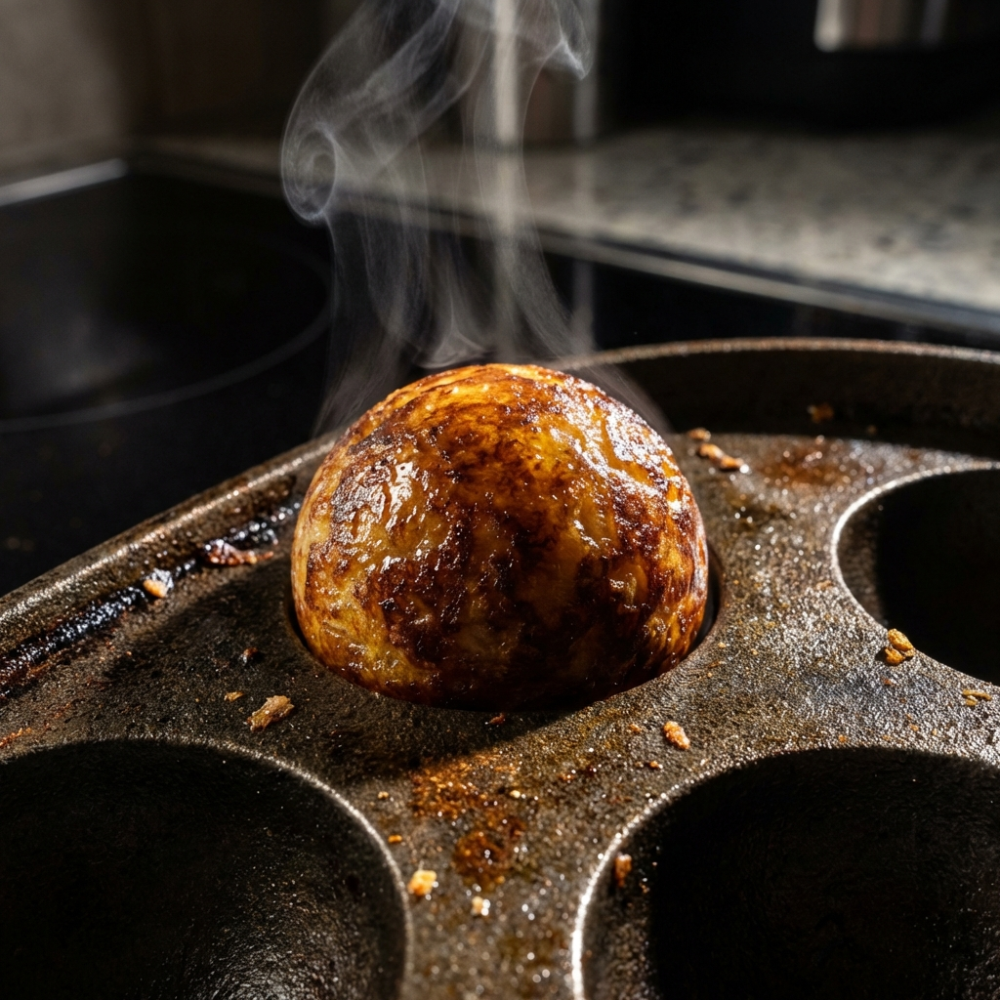

# Takoyaki Soul: Zen Mastery Edition 🦀🔥

## 概要
これは単なる「たこ焼き」のゲームではない。**「演算の極致」**と**「精神の調和」**が融合した、次世代の職人シミュレーターだ。
Androidネイティブの限界に挑むべく、物理演算の核心部を **Rust（ネイティブ・エンジン）** で再構築。ジャイロ操作とPID制御が織りなす「究極の球体」を目指せ。

## 究極の技術：Rust Native Physics Kernel (`takores`)
パフォーマンスを追求するため、重い演算はすべてRustにオフロード。C#とポインタで直結された**「ゼロコピー・アーキテクチャ」**が、実機での驚異的な応答性を実現している。

*   **3軸カルマンフィルタ (Kalman Filter)**: 生のジャイロセンサー値を極限まで平滑化。ノイズを排除し、職人の僅かな手振りを正確に捉える。
*   **ネイティブ・ソフトボディ・ソルバー**: 数千回の頂点更新を行うバネダンパ物理をRust側で並列実行。タコ焼きの「プルプル感」がかつてない次元へ。
*   **頂点平滑化カーネル**: PID出力に基づき、メッシュをリアルタイムに球体へとモーフィング。
*   **PID HUDアナライザー**: 制御工学の視覚化。**P（比例）/ I（積分）/ D（微分）**成分をHUDに表示し、数学的に「匠の技」を分析する。

## 禅・マスタリー・ゲームプレイ (Zen Mastery)
効率よりも「調和（Harmony）」を。

*   **Rhythmic Rotation**: 一定のリズムでデバイスを回転。マスターの拍動に同期するとマスタリーが上昇。
*   **Zen Visual Feedback**:
    *   **Camera Breathe**: ビートに合わせてカメラが呼吸するように鼓動（FOVパルス）。
    *   **Edge Glow / Shiny Glaze**: 完璧な調和（Harmony）に達すると、画面が黄金に輝き、タコ焼きに極上の艶が宿る。
    *   **Rhythmic Chimes**: 物理演算と同期した高精度な聴覚フィードバック。

## 遊び方 (How to Play)

心の平穏を保ち、デバイスを通じてタコ焼きと対話せよ。

### 1. 「回す」：究極の成型 (Steady Rotation)
画面下の**緑色のゲージ（Shaping Progress）**を減らすことが目的だ。
*   **操作**: デバイスをハンドルを回すように、一定の速度（TARGET_GYRO_MAG: 6.0 rad/s）で「くるくる」と回し続けろ。
*   **コツ**: 速すぎず、遅すぎず。HUDの**青いバー**が中央付近に留まるように維持すると、PID制御が最適化され、成型が加速する。
*   **Zenマスタリー**: 安定した回転を続けると「Mastery」が溜まり、画面端が黄金に輝き（Edge Glow）、タコ焼きが超高速で滑らかな球体へと変化する。

### 2. 「振る」：トッピング降臨 (Shaking)
職人の仕上げは大胆かつ繊細に。
*   **操作**: デバイスを「シュッシュッ」と縦・横に素早くシェイクしろ。ソース、マヨネーズ、青のり、そして「踊るかつお節」がふりかかる。
*   **解放条件**: 成型が進む（ゲージが減る）ほど、高次のトッピングがアンロックされる。

### 3. 「見る」：PIDアナライザー (Mathematical Guidance)
HUDに表示される3本の細いバーは、あなたの操作に対するRustエンジンの「思考」だ。
*   **赤 (P)**: 現在のズレに対する即時的な修正力。
*   **緑 (I)**: 蓄積された誤差を解消する粘り強い力。
*   **青 (D)**: 動きの変化を予測し、オーバーシュートを抑える制動力。
これらが安定しているとき、あなたは「匠」の域に達している。

## 視覚の魔術 (Cinematic Shaders)
*   **Hyper-Real Katsuobushi**: 
    熱で狂い舞う「かつお節」をプロシージャル・アニメーションで再現。リムライトと透過処理により、紙のように薄く繊細な質感を追求。
*   **Dynamic Toppings**:
    ソース、マヨネーズ、青のりが、シェイク（加速度センサー）によってダイナミックにふりかかる。

## プラットフォーム別セットアップ

### Android 版（Unity + Rust）
1.  **Build Rust**: `Takoyaki.Native/` をビルドし、`libtakores.so` を生成。
2.  **Unity Setup**: 上部メニュー **Takoyaki > Setup > Create Game Scene** を実行。
3.  **Run**: Android端末（推奨: Pixel 8以降）へデプロイ。

### Web 版（ブラウザ）
ブラウザで今すぐプレイ可能！ジャイロセンサー不要のマウス/タッチ操作版。

🌐 **[Play Now on GitHub Pages](https://furukawa1020.github.io/takoyakiapp/)**

詳細は [`web-version/README.md`](web-version/README.md) を参照。

## CI/CD とデプロイメント

このプロジェクトは GitHub Actions による完全な CI/CD パイプラインを備えている。

### 🔄 自動化されたワークフロー

#### 1. **Rust CI** (`rust-ci.yml`)
- Rust ネイティブライブラリのビルドとテスト
- コードフォーマットとリンティング (clippy)
- Android 向けクロスコンパイル (aarch64, armv7)
- ビルド成果物 (`libtakores.so`) のアーティファクト保存

#### 2. **Unity CI** (`unity-ci.yml`)
- Unity プロジェクト構造の検証
- C# スクリプトの存在確認
- プロジェクト設定の妥当性チェック

#### 3. **Web デプロイ** (`deploy-web.yml`)
- Web 版の自動テストとデプロイ
- HTML/JavaScript/CSS の検証
- GitHub Pages への自動デプロイ
- デプロイ URL: https://furukawa1020.github.io/takoyakiapp/

#### 4. **統合 CI** (`ci.yml`)
- リポジトリ全体の健全性チェック
- ファイル形式とコーディング規約の確認
- プロジェクトメトリクスの収集

### 🚀 デプロイメント戦略

- **Web 版**: `web-version/` 配下の変更時に自動デプロイ
- **Rust ライブラリ**: プルリクエストで自動ビルド・テスト
- **Unity プロジェクト**: 構造検証のみ（完全ビルドは Unity ライセンスが必要）

### 📊 ステータスバッジ
README 上部のバッジで、各ワークフローの状態を確認可能。

---
そこに、魂（ソウル）はあるか？
🦀 Rust Powered | 🔥 Zen Inspired | 🐙 Takoyaki Finalized
