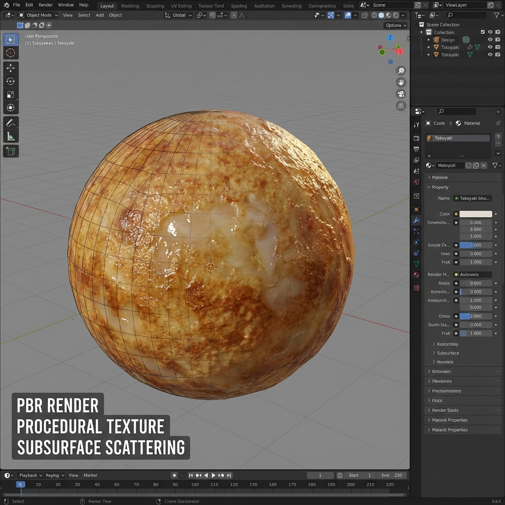

# 一球入魂 たこ焼き – TAKOYAKI PHYSICS

## 概要
これは「効率」のゲームではない。「一個にこだわる体験」だ。
コードファーストで設計されており、Unityエディタ上でセットアップツールを走らせるだけで、私のたこ焼き（物理・シェーダー・構成）が即座に立ち上がる。

## クイックセットアップ（自動化された魂）
面倒な手作業は排除した。以下の手順で、世界一丁寧な「たこ焼き環境」を構築せよ。

1. Unityを開く。
2. 上部メニューの **Takoyaki > Setup > Create Game Scene** を叩く。
3. 自動的にカメラ、ライト、UI、そして物理演算とシェーダーを纏った「たこ焼き（プレイヤー）」が生成される。
    *   **注記**: 外部アセットは不要だ。私のコードが、生の生地(Batter)、焼き目(Cooked)、そして焦げ(Burnt)のテクスチャをその場で**プロシージャル生成**し、シェーダーに注入する。すぐに“質感”を確認できるはずだ。

## 技術の核（このアプリの魂）

### 物理と操作 (Physics & Controls)
*   **InputManager**: ジャイロと加速度の翻訳者。実機では `InputManager.Instance.Calibrate()` で"構え"をゼロ補正する。エディタ上では矢印キーで傾き、スペースキーで「返し/振動」をエミュレートする。
*   **TakoyakiSoftBody**: **[NEW]** 質量バネダンパモデルによる頂点物理。単純な揺れではない。慣性、重力による沈み込み、衝撃による波打ち…生地の"重い粘性"を再現した。

### 視覚表現 (Cinematic Shader)

*   **TakoyakiCinematic**: ただの色変えではない。
    *   **SSS (サブサーフェス・スキャタリング)**: 生地の透け感を再現。火が通るにつれ、徐々に不透明な固体へと変化する。
    *   **Fresnel Oil (油膜フチ)**: 表面を覆う油のテラつき。焼き始めはヌルッと、焼けるとカリッとドライに、光沢が変化する。
    *   **Vertex Displacement (気泡)**: 熱で生地が膨らむ「あの感じ」を、ノイズマップによる頂点変位で表現。

### ゲームループと操作 (Game Loop)
*   **タイトル**: タップで開始。
*   **生地流し (Pouring)**: 端末を傾ける（または矢印キー）か、画面を長押しして生地を注ぐ。
*   **焼き (Cooking)**:
    *   **矢印キー**: タコ焼き機を傾けて熱の当たり方を変える（安定させると早く焼ける）。
    *   **スペースキー**: 「返し」。衝撃を与えてひっくり返す。
    *   **Sキー**: 「提供 (Serve)」。焼き上がったらSキーを押して皿に盛る。
*   **結果 (Result)**: スコアと職人のコメントが表示される。タップでリトライ。

## 開発者へのメモ
*   `Scripts/` : ロジックの全て
*   `Scripts/Visuals/` : シェーダーと物理の魔術
*   `Editor/` : 面倒を消し去る自動化ツール

さあ、Unityを開いて再生ボタンを押せ。あるいはビルドして実機で振れ。
そこに「熱」はあるか？
